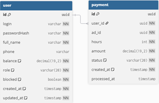
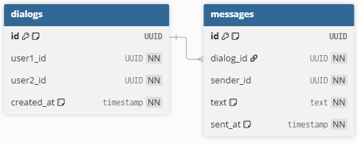

# Система размещения частных объявлений

Микросервисное приложение для размещения, поиска и продажи объявлений с личной перепиской между пользователями, рейтингом продавцов и платным продвижением объявлений.

## Архитектура проекта

Проект состоит из трёх микросервисов:

### User Service
- регистрация и аутентификация пользователей
- хранение профилей
- изменение личной информации
- пополнение баланса
- создание и обработку платежей на продвижение объявления в топ
- управление ролями, удалением и восстановлением пользователей
- получение публичных и приватных данных пользователей для других сервисов

### Ad Service
- создание, изменение, удаление и просмотр объявлений
- поиск и фильтрацию объявлений
- просмотр объявлений конкретного продавца
- покупка объявления
- добавление отзыва к покупке
- расчёт рейтинга продавца
- история продаж
- блокировка и восстановление объявлений для администратора и менеджера

### Message Service
- создание личных диалогов
- получение списка диалогов пользователя
- просмотр сообщений в диалоге
- отправка сообщений
- удаление диалогов и отдельных сообщений

## Схема микросервисов

### User Service


### Ad Service


### Message Service


## Роли и доступ

### Неавторизованный пользователь
- регистрация/вход

### Авторизованный пользователь
- редактирование профиля
- пополнение баланса
- создание, редактирование и удаление своих объявлений
- поиск и фильтрация объявлений
- покупка объявлений
- оставление отзывов
- личная переписка
- оплата продвижения объявления

### Менеджер
- всё, что доступно обычному пользователю
- блокировка и восстановление объявлений

### Администратор
- всё, что доступно менеджеру и пользователю
- получение полных данных пользователя (id, телефон, роль)
- изменение ролей пользователей
- блокировка и восстановление пользователей

## Общение между сервисами

Микросервисы взаимодействуют синхронно через REST API.

Для внутренних запросов используются:
- внутренние эндпоинты `/internal/...`;
- DTO-модели для передачи данных между сервисами;
- JWT-аутентификация и авторизация;
- клиентские классы `UserServiceClient` и `AdServiceClient`.

## Технологии

- Java 17
- Maven
- Spring Framework 6.2
- Spring Security 6.4
- PostgreSQL 16
- Liquibase 4.27
- Docker / Docker Compose
- MapStruct 1.5.5
- JJWT 0.12.5
- SLF4J + Logback
- Hibernate 6.4

## Запуск проекта

### Через Docker Compose
Из корня проекта:

```bash
docker compose up
```

После запуска будут доступны:

- User Service — `http://localhost:8081`
- Ad Service — `http://localhost:8082`
- Message Service — `http://localhost:8083`


## Бизнес-логика

- Удаление пользователя и объявления выполняется логически: данные не удаляются физически, а меняется статус
- Для объявлений используется статус `ARCHIVED`
- Для пользователей используется флаг `blocked`
- Продвижение объявления в топ происходит после создания и обработки платежа
- В системе есть история платежей, история продаж и рейтинг продавца


## Структура проекта

- `user-service` — сервис пользователей и платежей
- `ad-service` — сервис объявлений и покупок
- `message-service` — сервис диалогов и сообщений
- `docker-compose.yml` — запуск БД и сервисов
- `images/` — схемы баз данных микросервисов

## Примечания

- Каждый сервис хранит свою базу данных отдельно (У каждой БД своя схема)
- Обмен данными между сервисами выполняется через REST-клиенты
- Все API защищены JWT-токенами
- При запуске в БД автоматически добавляется админ (Логин: `admin`  Пароль: `admin123`)
