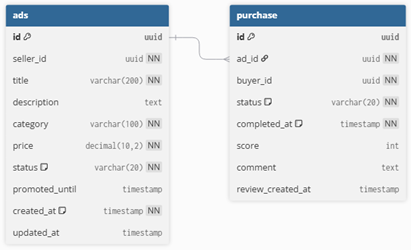
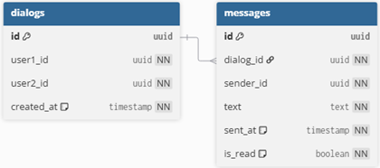

Система размещения частных объявлений.

Архитектура проекта
User Service — регистрация, профили, аутентификация, роли, баланс, платежи

Ad Service — управление объявлениями (CRUD), поиск, фильтрация, отзыв об объявлении, рейтинг продавца, история продаж

Message Service — личная переписка

Роли и доступ 
Неавторизованный пользователь:
•	регистрация/авторизация

Авторизованный пользователь:
•	всё что может неавторизованный пользователь
•	редактировать профиль
•	создавать объявления
•	редактировать и удалять свои объявления
•	оставлять отзыв к объявлению
•	вести личную переписку
•	оплачивать продвижение объявления

Модератор:
•	всё что может пользователь
•	удалять и изменять объявления и комментарии

Админ:
•	выполнять все операции в системе
•	выводить информацию о всех пользователях
•	изменить роли пользователей 
•	заблокировать и восстановить пользователя 
Админ создаётся при запуске программы (логин: admin, пароль: admin123)

Общение между микросервисами:
Микросервисы общаются синхронно через REST API.
Каждый сервис предоставляет внутренние эндпоинты (например /internal/ads/{id}).
Для вызовов используются RestTemplate и классы-клиенты (UserServiceClient, AdServiceClient).
При ошибках (недоступность, невалидный ответ) клиент бросает исключение, которое обрабатывается на уровне вызывающего микросервиса.
Данные передаются в виде DTO (AdInternal, UserInternal).

Удаление сущностей:
При удалении user и ad, самого удаления из БД не происходит. Меняется статус поля blocked и status. При удалении пользователя, поле blocked становится true. При удалении объявления, поле status становится ARCHIVED. Админы могут восстановить профиль, менеджеры могут восстановить объявления.
